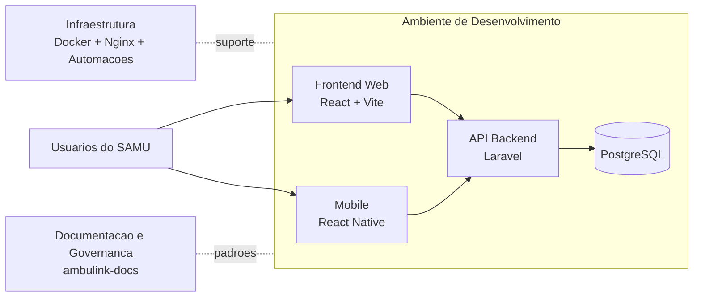

  

# Bem-vindo(a)  ao AMBULINK

Sistema de apoio ao atendimento de ocorrências do SAMU de Campo Grande/MS.

O **AMBULINK** substitui o antigo e-SUS SAMU, cobrindo o fluxo completo do atendimento: da chamada ao 192 até o encerramento da ocorrência. O ecossistema integra aplicações web e mobile, API backend, infraestrutura de desenvolvimento e documentação institucional.

---

## Visão Geral

O projeto possui foco em confiabilidade operacional, rastreabilidade e padronização de processos para suporte a operações de urgência e emergência.

| Componente | Tecnologia principal | Objetivo |
| ---------- | -------------------- | -------- |
| Backend | Laravel + PostgreSQL | API REST, regras de negócio e persistência |
| Frontend | React + Vite + TypeScript | Sistema web para operação interna do SAMU |
| Mobile | React Native | Aplicativo para equipes de ambulância |
| Infraestrutura | Docker + Nginx + automações | Padronização do ambiente de desenvolvimento e operação |
| Documentação | Markdown + artefatos oficiais | Governança técnica, fluxo de contribuição e materiais de apoio |

---

## Repositórios Oficiais

| Módulo | Repositório | Descrição |
| ------ | ----------- | --------- |
| Backend | [ambulink-backend](https://github.com/ambulink-ms/ambulink-backend) | API Laravel + PostgreSQL |
| Frontend | [ambulink-frontend](https://github.com/ambulink-ms/ambulink-frontend) | Sistema web utilizado pela equipe interna do SAMU |
| Mobile | [ambulink-mobile](https://github.com/ambulink-ms/ambulink-mobile) | Aplicativo utilizado pela equipe de ambulância |
| Infra | [ambulink-infra](https://github.com/ambulink-ms/ambulink-infra) | Infraestrutura de desenvolvimento, deploy e automações |
| Documentação | [ambulink-docs](https://github.com/ambulink-ms/ambulink-docs) | Documentação de processo, padrões e materiais institucionais |

---

## Materiais e Documentações Oficiais

| Documento | Descrição | Acesso |
| --------- | --------- | ------ |
| Documentação Geral Oficial (PDF) | Documento oficial de escopo funcional e técnico do software. | [Abrir documento](https://drive.google.com/file/d/1r51f5pAKkAsrSg-gePfa_ciKb3CNrtf1/view?usp=drive_link) |
| Documentação API Backend (Swagger) | Endpoints REST do backend com exemplos de requisição. | [Acessar via ambinete de desenvolvimento do backend (Leia documentação)](https://github.com/ambulink-ms/ambulink-backend/blob/develop/README.md#documenta%C3%A7%C3%A3o-da-api-swagger) |
| Documentação do Banco de Dados PostgreSQL (dbdocs.io) | Representação lógica completa do banco de dados. | [Abrir documentação](https://dbdocs.io/ambulinkms/ambulink-db) |

---

## Arquitetura do Ecossistema

No ambiente de desenvolvimento, backend e banco rodam em Docker e o frontend roda no host com proxy para a API, conforme padrão adotado nos repositórios oficiais.

---

## Equipe Técnica

O projeto é mantido por **SENAC MS**, **SEMADESC** e **Prefeitura de Campo Grande/SESAU**, com equipe técnica dedicada ao desenvolvimento e implantação.

### Product Owner

| Nome | LinkedIn | GitHub |
| ---- | -------- | ------ |
| Jeandro Dias |  |  |

### Tech Leads

| Nome | LinkedIn | GitHub |
| ---- | -------- | ------ |
| Caio Branquinho |  |  |
| Davi Lima |  |  |
| Eduardo Cavalcante |  |  |
| Guilherme Martins |  |  |

### Desenvolvedores

| Nome | LinkedIn | GitHub |
| ---- | -------- | ------ |
| Eydi Nishimoto |  |  |
| Gabriel Costa |  |  |
| Mateus Storti |  |  |
| Tesmam Pereyra |  |  |

---

## Matérias e Reconhecimento Público

O AMBULINK vem sendo destaque em veículos de comunicação e portais institucionais, reforçando seu impacto na modernização do atendimento do SAMU de Campo Grande/MS e na inovação em saúde pública.

- [Jovens programadores desenvolvem sistema para o SAMU durante maratona do Senac](https://diariomsnews.com.br/noticias/jovens-programadores-desenvolvem-sistema-para-o-samu-durante-maratona-do-senac/) - Diário MS News (29/11/2024)
- [Vencedores do Senac Decola vão ajudar SAMU com desenvolvimento de software](https://ms.senac.br/senac/noticias/v/vencedores-do-senac-decola-vao-ajudar-samu-com-desenvolvimento-de-software) - Senac MS (16/02/2025)
- [Senac Decola e SAMU aprimoram sistema de emergência em MS](https://portaldocomercio.org.br/sistema-comercio/senac-decola-e-samu-aprimoram-sistema-de-emergencia-em-ms/) - Portal do Comércio (12/03/2025)
- [Sistema criado por estudantes moderniza atendimento emergencial](https://g1.globo.com/ms/mato-grosso-do-sul/videos-bom-dia-ms/video/sistema-criado-por-estudantes-moderniza-atendimento-emergencial-13489822.ghtml) - G1 / Bom Dia MS (04/04/2025)
- [Tecnologia Ambulink SAMU](https://atualnews.com.br/tecnologia-ambulink-samu/) - Atual News (18/04/2025)
- [Sistema criado por alunos do Senac será usado pelo SAMU de Campo Grande](https://msconecta.com.br/noticia/10571/sistema-criado-por-alunos-do-senac-sera-usado-pelo-samu-de-campo-grande) - MS Conecta (18/04/2025)
- [Novo sistema Ambulink moderniza atendimento do SAMU em Campo Grande](https://www.diariodigital.com.br/geral/novo-sistema-ambulink-moderniza-atendimento-do-samu-em-campo-grande) - Diário Digital (18/04/2025)
- [Tecnologia desenvolvida por estudantes será usada pelo SAMU em Campo Grande](https://totalnewsms.com.br/cultura/tecnologia-desenvolvida-por-estudantes-sera-usada-pelo-samu-em-campo-grande/) - Total News MS (19/04/2025)
- [Alunos do Senac entregam sistema que vai modernizar atendimento do SAMU em Campo Grande](https://impactomais.com.br/saude/alunos-do-senac-entregam-sistema-que-vai-modernizar-atendimento-do-samu-em-campo-grande/) - Impacto Mais (22/04/2025)
- [Prefeitura apresenta relatório quadrimestral da Saúde e Comitê Gestor projeta melhorias na rede](https://www.campogrande.ms.gov.br/cgnoticias/noticia/prefeitura-apresenta-relatorio-quadrimestral-da-saude-e-comite-gestor-projeta-melhorias-na-rede/) - Prefeitura de Campo Grande / CG Notícias (29/09/2025)

---

  

  © 2025 AMBULINK • Sistema Oficial do SAMU Campo Grande/MS

